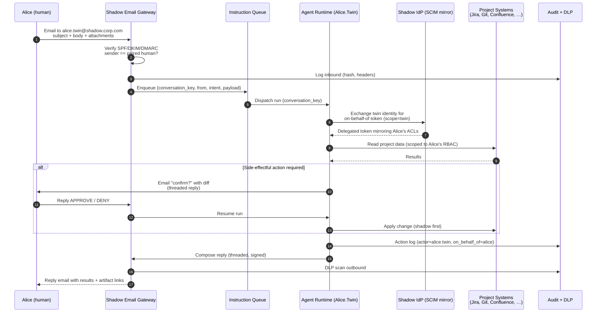
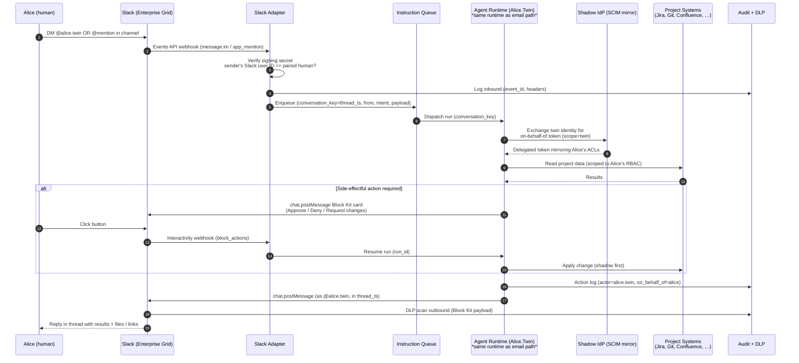

# Use Case — Paired Agentic Employee

## Summary

Every real employee in the live org has a paired **agentic employee** running in the shadow region. The twin mirrors the human's project and resource access and is driven from whichever channel the human already lives in — **email** for durable, long-form instruction and audit, and **Slack** for fast, conversational iteration. Both channels are existing surfaces — no new client app — and both land on the same agent runtime, the same identity model, and the same immutable audit plane. The choice of channel is ergonomic, not architectural.

This is the minimum-friction entry point into the [[Digital Twin Transformation|digital twin delivery model]] — the human sends instructions where they already work, the twin executes in the shadow, and results come back in the same thread.

## Actors

- **Alice** — real employee in the live org. Identity: `alice@corp.com`.
- **Alice.Twin** — agentic employee in the shadow region. One logical identity with multiple surfaces:
  - Shadow IdP principal (source of truth for access).
  - Mailbox `alice.twin@shadow.corp.com` on a separate SMTP domain.
  - SCIM-provisioned Slack user on Enterprise Grid with its own handle, avatar, and presence — `@alice.twin` in Slack.
- **Shadow IdP** — identity provider for the shadow region, SCIM-synced from the live IdP and fanning the twin's identity out to every downstream system, including Slack Enterprise Grid.
- **Agent Runtime** — the execution plane that runs the twin (orchestrator + tools + memory, e.g. Cognee-backed). Front-door-agnostic: email and Slack adapters enqueue into the same dispatch path.
- **Email Gateway** — inbound/outbound mail handler for the shadow domain (e.g. SES inbound rules, Microsoft Graph subscriptions, or a Postfix + milter front door).
- **Slack Adapter** — Events API + interactivity webhook handler that receives validated Slack events and enqueues them for the same runtime.

## End-to-end flow — Email path

## End-to-end flow — Slack path

Both diagrams share the same `Agent Runtime`, `IdP`, `Project Systems`, and `Audit + DLP` participants on purpose: **one runtime, two front doors**.

## Mechanism — component by component

### 1. Identity and provisioning

- **One twin per human, created automatically.** An onboarding hook in the live IdP fires a SCIM event into the shadow IdP that provisions `alice.twin` as a service principal with a mailbox. Offboarding fires the reverse hook; the twin is disabled within one sync cycle.
- **Access by mirroring, not impersonation.** The twin is added to the *shadow* copies of every group Alice belongs to in live. The shadow groups are kept in lock-step with live groups via a nightly reconciler that reads live group membership and rewrites shadow membership (diff + apply). The twin never holds Alice's credentials.
- **SCIM fan-out to Slack.** The shadow IdP's SCIM feed provisions Alice.Twin as a real Slack user in Enterprise Grid alongside the other downstream systems. Alice.Twin appears natively in Slack with its own handle, avatar, and presence — not as a persona overlay on a shared bot. Group-membership mirroring extends to Slack workspaces and private-channel invites where Alice is a member, gated by the same nightly reconciler. Offboarding deprovisions the Slack user on the same cycle as the IdP principal.
- **Token model.** When the runtime needs to call a project system on behalf of the twin, it exchanges the twin's service-principal credential for an OAuth token via an **on-behalf-of** flow with a dedicated `twin` scope. Downstream systems see `actor=alice.twin, on_behalf_of=alice` in every request — auditable, revocable, and distinct from Alice's own sessions.

### 2. Instruction channels

Two front doors, one dispatch path. Both adapters produce the same structured record — `{conversation_key, from, intent, payload, received_at}` — and enqueue into the same instruction queue. The runtime cannot tell which channel a run came from, and does not need to.

#### 2a. Email

- **Dedicated domain.** `shadow.corp.com` is a separate SMTP domain with its own MX, SPF, DKIM, and DMARC. This keeps twin traffic out of live mail flow and makes DLP, retention, and legal hold policies easy to target.
- **Inbound validation.** The email gateway enforces:
  1. SPF + DKIM + DMARC pass on the inbound message.
  2. `From:` header matches the human paired to the addressed twin (lookup in the pairing table). Anything else bounces with a signed rejection.
  3. Thread continuity: replies must carry a valid `In-Reply-To` / `References` header chain to a run the twin started — prevents spoofed mid-run "APPROVE" messages.
- **Intent extraction.** The gateway pushes the validated message onto the instruction queue with `conversation_key` = root `Message-Id` of the thread. The runtime treats `conversation_key` as the conversation handle so multi-turn exchanges resume in the same agent state.

#### 2b. Slack

- **App scope and events.** A Slack app installed at Enterprise Grid scope with Events API subscriptions: `message.im` (DMs to the twin), `app_mention` (mentions in channels the twin is invited to), and `message.channels` limited to an allow-list of project channels. The twin subscribes only to what it needs.
- **Inbound validation.** The Slack adapter enforces:
  1. Slack request signing secret verified on every webhook — rejects anything not originating from Slack.
  2. Sender's Slack user ID must resolve, via the SCIM-synced pairing table, to the human paired with the addressed twin. DMs from anyone else are ignored; channel mentions by non-paired members are ignored unless that collaborator is on Alice's explicit allow-list.
  3. Event de-duplication via Slack's `event_id` — prevents replays.
- **Conversation continuity.** `conversation_key` = `thread_ts`. Multi-turn runs resume in the same agent state exactly as email threads do; the runtime does not distinguish.
- **Channel semantics.** In a private project channel, the twin acts only on explicit `@alice.twin` mentions from Alice (or from collaborators Alice has pre-authorised). Passive channel traffic is ingested as read-only context only if the per-twin memory policy permits it — off by default.
- **Slash commands.** `/twin stop` to kill an active run, `/twin status` to list active runs and their stage, `/twin authorise <scope>` to edit standing authorisations without leaving Slack. Slash commands go through the same signing-secret and pairing checks as events.

### 3. Agent runtime (the twin itself)

The runtime is front-door-agnostic: email and Slack adapters enqueue into the same dispatch path with the same `{conversation_key, from, intent, payload}` record, and the runtime treats them identically.

- **Memory.** The twin's long-term memory lives in the shadow region's Cognee instance (see [[diagrams/Cognee Docker VPS Deployment|Cognee Docker VPS deployment]]) — one container per project or one per employee, isolated by network and volume. Memory is keyed by `(twin_id, topic)` so context carries across channels even when a single task spans email and Slack.
- **Tool belt.** Read-scoped connectors to Jira, Git hosting, Confluence/Wiki, Slack search, calendar, and internal APIs. Each tool call carries the on-behalf-of token; any 403 returned by a live system is a truthful reflection of Alice's own access.
- **Planning + execution.** The orchestrator plans, executes read steps freely, and pauses before any side-effectful step to request confirmation via the originating channel — an email reply for email-initiated runs, a Block Kit approval card for Slack-initiated runs.
- **Shadow-first writes.** Writes land first against *shadow copies* of target systems (shadow Jira project, shadow repo fork, draft Confluence space). Promotion to live is a separate, explicitly-gated step — this is the core of the shadow-run methodology and is what lets the twin act ambitiously without risk.

### 4. Result channels

The runtime renders results into whichever surface the run came from. Both paths hit the same DLP scanner and the same audit log.

#### 4a. Email

- **Threaded replies.** The runtime composes its response with the original `Message-Id` in `In-Reply-To`, so the reply lands in Alice's existing thread. No new inbox noise.
- **Machine-readable header.** Every outbound carries `X-Agentic-Twin: true` and `X-Twin-Run-Id: <uuid>` so Alice can filter, and so downstream automation can distinguish twin output from human output.
- **Artifacts by link, not by paste.** Large outputs (diffs, generated docs, datasets) are written to a shadow artifact store and referenced by signed URL with short TTL. Keeps emails small and makes revocation easy.
- **DLP on egress.** The gateway scans outbound for secrets, PII, and classification markers before sending. A blocked message is replaced by a notification to Alice explaining why.

#### 4b. Slack

- **Posted as the twin.** Replies go out via `chat.postMessage` in the same `thread_ts`, posted *as* `@alice.twin` — Slack's native identity UI does the "this is from the twin" signalling, not a bot badge on a shared app.
- **Interactive approvals.** Block Kit cards with Approve / Deny / Request-changes buttons replace the email reply-APPROVE pattern. Clicks hit the Slack interactivity endpoint, which resolves the `run_id` from the block value and resumes the paused run. Single click, seconds-latency — this is the specific reason Slack earns its place alongside email.
- **Artifacts.** Small outputs inline as Block Kit sections. Large outputs as Slack file uploads *or* signed URLs into the shadow artifact store, depending on classification — the DLP policy decides which of the two is allowed for a given run.
- **DLP on egress.** The same scanner used for email runs on the rendered Block Kit payload before `chat.postMessage`. A blocked message becomes an ephemeral notification to Alice explaining why — consistent with the email behaviour.
- **Presence as health signal.** Alice.Twin's Slack presence tracks runtime health: online when the runtime is healthy, away when degraded, offline when the twin is disabled. Zero-cost status indicator that Alice reads without thinking.

### 5. Safety, audit, kill switch

- **Immutable audit.** Every inbound, every tool call, every outbound is written to an append-only log keyed by `run_id` and `conversation_key`. `conversation_key` covers both email `Message-Id` chains and Slack `thread_ts` — one schema, two front doors.
- **Per-twin rate limits.** Caps on tool calls per hour, outbound email volume, and outbound `chat.postMessage` volume. A misbehaving twin cannot flood Alice's inbox, hammer project systems, or spam a Slack channel.
- **Three kill switches.**
  1. Alice replies `STOP` (or any configured safe word) in the email thread → runtime terminates the run and suspends the twin pending review.
  2. Alice types `/twin stop` in Slack → same effect, reachable in one keystroke from wherever she is.
  3. An admin disables the twin centrally in the IdP; SCIM propagates, the email gateway starts bouncing inbound, and the Slack user goes offline within seconds.
- **Drift detection.** A nightly job diffs the twin's shadow group memberships, Slack channel memberships, and mailbox permissions against Alice's live equivalents and alerts on drift — prevents stale over-privilege in any surface.

## Worked examples

### Via email

> **Alice →** `alice.twin@shadow.corp.com`
> **Subject:** Triage the PAY-* bug backlog
> *Body:* "Please look at all open PAY-\* bugs assigned to our team, group them by root-cause area, and draft a triage doc. Flag anything that looks like a regression from last week's release."

1. Gateway validates the message, enqueues it with `conversation_key` = root `Message-Id`.
2. Runtime loads Alice.Twin's memory, exchanges for an OBO token, queries Jira via Alice's ACLs, pulls the last release's commits via Git, clusters tickets, drafts a Confluence page in the shadow space.
3. Runtime replies in-thread: short summary, bullet list of clusters, regression candidates called out, signed link to the draft doc, `X-Agentic-Twin: true`.
4. Alice reads on her phone, replies "ship the draft to the real space." Runtime treats this as a write, pauses, emails a confirmation with the exact diff, Alice replies `APPROVE`, runtime promotes shadow → live and records the action against `on_behalf_of=alice`.

### Via Slack

> **Alice →** DM to `@alice.twin`: "triage the PAY-\* backlog — cluster by root cause, flag regressions from last week's release."

1. Slack adapter verifies the signing secret, resolves the sender to Alice via the SCIM-synced pairing table, enqueues the event with `conversation_key` = `thread_ts`.
2. Runtime runs the exact same plan as the email case: memory load, OBO token, Jira + Git reads, draft in the shadow Confluence space. Same runtime, same tools, same audit records.
3. Runtime posts a threaded Block Kit reply as `@alice.twin`: summary section, clusters as bullet blocks, regression candidates in a highlighted section, a link button to the draft.
4. Alice replies in-thread: "ship it to the real space." The runtime pauses and posts a Block Kit approval card with the diff and three buttons: Approve / Deny / Request changes.
5. Alice clicks **Approve**. The interactivity webhook resumes the paused run; the runtime promotes shadow → live and posts a completion message in the same thread with links to the published page and the audit record.

Same work, same guarantees, one-click approval loop.

## Why this is viable

- **Two front doors, one runtime.** Email gives durability, long-form context, and universal reach including offline and mobile; Slack gives low-friction iteration for the high-frequency tasks where a round-trip-per-minute approval loop is the difference between useful and useless. Both land on the same runtime, the same identity, and the same audit log, so the choice is ergonomic, not architectural.
- **No new client surface.** Both surfaces are already universal, already audited, already retained, already mobile. The human doesn't learn a new tool.
- **Identity is honest on both channels.** Per-twin SCIM-provisioned Slack users mean Alice.Twin is a first-class Slack citizen with its own avatar and presence — no confusing shared bot persona, no user wondering whose twin just replied. On email, the separate `shadow.corp.com` domain does the same job.
- **Blast radius is bounded.** Shadow-first writes + explicit confirmation (reply or button) mean the twin can be ambitious on reads and conservative on writes, which matches where the value and the risk actually sit.
- **Reversible at any moment.** `STOP` reply, `/twin stop`, or an IdP toggle takes the twin out of the loop without touching Alice's own access — whichever surface is nearest to hand.

## Open questions

- **Channel-spanning conversation continuity.** If Alice starts a task over email and follows up over Slack (or vice versa), should the twin stitch them into one conversation? Proposed direction: memory is keyed by `(twin_id, topic)` so the underlying context is unified, but the visible conversation thread stays per-channel to avoid surprising cross-posts. Needs confirmation before build.
- **Standing authorisations.** Per-system standing authorisations ("you may comment on Jira tickets without asking, but never transition them") need a single store that both channels honour. Candidate: a per-twin policy document editable via `/twin authorise` in Slack or a structured email command, with changes themselves requiring human confirmation.
- **Shared mailboxes and delegates.** How does pairing work when the human is a shared inbox, has EA delegates who legitimately send on their behalf, or receives messages from multiple Slack workspaces? Likely needs an allow-list of additional `From:` addresses and Slack user IDs per twin.
- **Guest channels and external collaborators.** What happens when Alice.Twin is in a Slack Connect channel with a partner org? Default: twin does not act, ingests nothing, and requires explicit admin opt-in per external channel.
- **Enterprise Grid cost and licensing.** Per-twin Slack seats are a real line item at scale. Procurement prerequisite, not a technical blocker — but a number that needs to land in the business case before rollout.
- **Cross-twin collaboration.** Can Alice.Twin email or DM Bob.Twin directly? Probably yes, but only inside the shadow domain / shadow Slack scope and only with both humans' standing consent — otherwise twins can quietly form a back-channel org.

## Related

- [[Digital Twin Transformation]]
- [[AI Native Delivery Transformation]]
- [[Cognee Knowledge Engine for the Digital Twin]]
- [[diagrams/Cognee Docker VPS Deployment]]

## Revision History

| Version | Date       | Author        | Changes                                                                                                                                                                                                                                                                                                 |
|---------|------------|---------------|---------------------------------------------------------------------------------------------------------------------------------------------------------------------------------------------------------------------------------------------------------------------------------------------------------|
| 0.1     | 2026-04-12 | Manas Pradhan | Initial use case — paired agentic employee driven by email.                                                                                                                                                                                                                                             |
| 0.2     | 2026-04-13 | Manas Pradhan | Added Slack as a second instruction/response channel alongside email. Restructured Mechanism and Result sections into channel-agnostic core plus Email/Slack subsections. Title and filename generalised from "via Email" to "Paired Agentic Employee". Slack identity: per-twin SCIM-provisioned Slack users on Enterprise Grid. |
